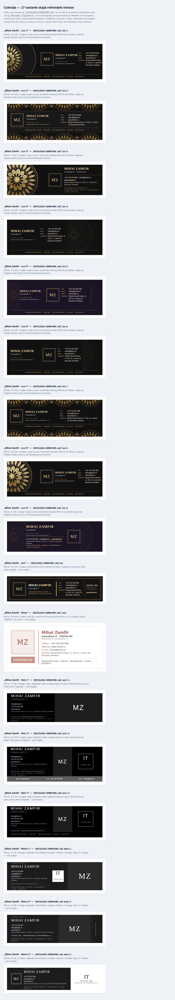

# Semnături e-mail — Mihai Zamfir / ITISTUL.RO

**Patru** semnături Outlook plus **o colecție de 17 variante** după referințele trimise —
toate **fără nimic de urcat pe site**. Instalatorul le pune pe toate (21); le comuți din
Outlook la compunerea unui mesaj (`Message > Signature`).


| | „Mihai Zamfir - Signet" | „Mihai Zamfir - Puls" | „Mihai Zamfir" | „Mihai Zamfir - Clasic" |
|---|---|---|---|---|
| Design | **executivă**, nou | **grafică**, nou | compactă | designul original |
| Imagini | **niciuna** | **niciuna** | bandă GIF (sau celule) | bandă GIF (sau celule) |
| Lățime | 580 px | 560 px | 560 px | 680 px |
| Sursă HTML | 8,4 KB | 14,3 KB | 8,1 KB | 14,8 KB |
| Implicită | `... signet` | `... puls` | da | `... clasic` |

## Colecția — 17 variante după referințe



Referințele trimise (Luxury Email Signature „Chapter 01", Rosalie Moses, Emma Johnson,
Jessica Roche, Theo Wilton) sunt **imagini întregi** — PNG-uri exportate din Canva/Photoshop.
Trimise ca semnătură, ele au exact problema din care a pornit tot proiectul: o singură
imagine, blocată implicit de Outlook, cu text neselectabil și linkuri inexistente.
Colecția reface fiecare compoziție din **text și celule**, cu aceleași proporții și aceeași
paletă, plus îmbunătățirile de mai jos.

| Familie | Variante | Ce e | Imagini |
|---|---|---|---|
| **Lux** | `lux-1` … `lux-9` | negru/auriu, ornamente mandala (cele 9 din „Chapter 01"), 2 pe fundal prună | 1–2 PNG-uri de ornament, de pe GitHub |
| **Aur** | `aur` | ramă dublă aurie, medalion cu inel dublu, bară aurie (Theo Wilton) | **niciuna** |
| **Rose** | `rose` | card alb, accente roz-teracotă, buton „Contactează-mă" (Rosalie Moses) | **niciuna** |
| **Noir** | `noir-1` … `noir-3` | negru, tipografie subțire spațiată, bară de subsol gri (Emma Johnson) | **niciuna** |
| **Mono** | `mono-1` … `mono-3` | negru/alb, serif, sigla „IT" în pătrat, panou alb (Jessica Roche) | **niciuna** |

Numele în Outlook: `Mihai Zamfir - Lux 3`, `Mihai Zamfir - Rose`, `Mihai Zamfir - Noir 2` etc.
Implicita se alege cu argumentul din tabel: `INSTALEAZA-SEMNATURA.cmd lux-3`.

**Fotografia.** Toate referințele au portret. Până la primirea fotografiei, în locul ei stă
un **medalion cu monograma „MZ"**, construit din celule (chenar dublu, deci nu poate fi
blocat). Când există fotografia, medalionul e înlocuit în toate variantele; pe Lux se poate
monta și în rama „floare" aurie din referință. Fotografia va fi o imagine (nu există altă
cale), deci va avea comportamentul imaginilor remote: se vede automat în Gmail, Apple Mail,
Outlook pe telefon și la orice destinatar care te are în Contacts; în Outlook Classic la un
destinatar necunoscut apare după „Download pictures".

**Ornamentele Lux** sunt PNG-uri de 1–18 KB generate procedural (nu stock), **coapte pe
fundalul exact al celulei** (`#111111` / `#1b1424`, fără transparență — motorul Word nu
are surprize cu ele) și fixate pe un SHA de commit, ca banda GIF. Textul **nu stă niciodată
peste ornament**: ornamentul are celula lui, textul pe a lui. Așa, când imaginile sunt
blocate, dispare doar decorul — numele, contactele și liniile aurii rămân, iar layout-ul nu
se mișcă. În referință dispărea totul.

**Îmbunătățiri față de referințe**, aceleași pentru toate 17:

- linkuri reale (`tel:`, `mailto:`, site, hartă) și text selectabil, nu pixeli;
- diacritice corecte (referințele erau în engleză, fără);
- contrast: rozul din Rosalie Moses (2,6:1) e închis la 4,6:1, bara gri din Emma Johnson
  la 5,9:1 — se citește și pe ecran prost;
- etichete `TEL / MAIL / WEB / ADRESĂ` în loc de pictograme (pictogramele ar fi fost imagini
  sau glifuri Unicode pe care iOS le transformă în emoji);
- fără colțuri rotunjite, fără nume scris vertical, fără gradient: motorul Word nu le
  randează, deci nu apar nicăieri — în loc de o variantă care se strică, una care ține;
- dark mode: culoarea e declarată pe același element ca fundalul, deci se inversează
  împreună (sau deloc);
- fiecare variantă are o singură tabelă exterioară, celule cu `bgcolor`, paragrafe fixate,
  fonturi inline — tot setul de reguli din `DE-CE-ASA.md`, verificat mecanic.

Ce nu s-a putut păstra: mandala nu se poate desena din celule (de aici PNG-ul), rama
rotundă din Theo Wilton e pătrată, numele scris vertical din Emma Johnson / Jessica Roche
e înlocuit cu o linie verticală sau cu literele suprapuse pe rânduri (Mono 2).

## Puls — semnătura grafică

Registrul întunecat pe care l-ai cerut de la început, cu banda rezolvată definitiv: un
bloc bleumarin cu ramă „chrome", iar eroul e o **undă pătrată construită din celule**
care urcă din albastru spre un vârf albastru-deschis. Deasupra, wordmark-ul și
tagline-ul într-o bandă de titlu; dedesubt, numele, rolul, contactele, adresa, și o
bandă de status cu disciplinele.

**Nicio imagine.** Unda e făcută din 32 de celule colorate, un singur tabel, adâncime 1.
Nu poate fi blocată, descărcată sau încorporată greșit de Outlook — problema care a
mâncat jumătate din acest proiect nu mai există prin construcție. Nu se animează;
în schimb apare la toată lumea, mereu.

## Signet — semnătura executivă

Brief-ul: „ca pentru un CEO de top". Răspunsul: reținere. Un **semn** precis de 52×52 —
câmp bleumarin, „IT" în Georgia alb, un soclu de 4 px în albastrul de brand — lângă
numele în Georgia și titlul în italic. Sub ele, o linie de letterhead de 1 px, o
singură linie de contacte în cerneală monocromă, adresa, apoi wordmark-ul
`ITISTUL.RO` spațiat și disciplinele în majuscule mute. **Nimic bold, nimic decorativ,
albastrul apare o singură dată.**

Georgia e instalată pe orice Windows și Mac și e randată corect de motorul Word —
serifa dă exact gravitatea pe care n-o au celelalte două.

De ce e cea mai robustă din pachet: **nu conține nicio imagine**. Semnul e făcut din
celule, linia e un `border-top`. Nu există nimic de blocat de client, de descărcat de
pe undeva, de încorporat de Outlook sau de filtrat de server. E lecția întregului
proces, aplicată de la zero.

Ce mai trebuie să știi: 4 tabele, adâncime 2, 16 celule, 6 celule grafice, 8.433 B;
toate perechile text/fundal peste 5:1; culoarea e declarată pe același element ca
fundalul, deci dark mode-ul inversează totul împreună.

Ambele au aceleași protecții, aceleași diacritice ca entități numerice, același
mecanism de atașare inline a benzii. Diferă doar compoziția.

## Designul clasic — ce s-a păstrat și ce s-a reparat

Compoziția, paleta, mărimile și textele sunt **exact** cele din pachetul original:
blocul bleumarin cu bara albastră de 8 px, plăcuța logo cu cele două dale, coloanele
`MOBILE`/`E-MAIL` și `ONLINE`/`HQ`, banda animată, sloganul din subsol și butonul
`OPEN ITISTUL.RO →`.

S-au schimbat doar lucrurile care îl stricau la destinatar:

| Ce era | De ce strica | Ce s-a făcut |
|---|---|---|
| 4 tabele suprapuse la nivel superior | Word inserează un paragraf gol `MsoNormal` între două tabele adiacente — de aici spațiile inegale între benzi | un singur tabel cu rânduri |
| 13 `<div>` de layout | Word nu aplică fiabil `padding`/`margin` pe `<div>` | `<td>` și `<p style="margin:0;padding:0">` |
| `width="50%"` + padding pe aceeași celulă | modelul de casetă se rezolvă diferit între clienți | coloane în pixeli, care însumează exact 678 |
| GIF remote de 132 KB, 640×36 | blocat implicit; cadru gol la blocare | 638×26, 10 KB, atașat inline, fundal `#f8fbfd` identic cu celula |
| `font-weight:800` | nesuportat de motorul Word | 700 |
| `font-size:10.5px` | dimensiunile fracționare se rotunjesc imprevizibil | 11 px |
| diacritice brute UTF-8 | Outlook rescrie fișierul și le poate strica | entități numerice |
| linkuri fără `<span>` | stilul de caracter Hyperlink din Word rescrie fontul și culoarea | `<a><span>` cu formatare repetată |

### Ce trebuie să știi înainte să alegi clasica

- **E de 1,8× mai grea** (14,8 KB față de 8,1 KB). Într-un fir citat de 4–5 ori se
  apropie de pragul de 102 KB la care Gmail taie mesajul cu „[Message clipped]".
- **680 px** depășește panoul de citire la o fereastră Outlook obișnuită și se
  micșorează pe telefoanele înguste.
- Etichetele `MOBILE`/`E-MAIL`/`ONLINE`/`HQ` folosesc `#98a2b3` la 9 px, adică un
  contrast de **2,58:1** — sub pragul WCAG AA de 4,5:1. Am păstrat culoarea exact
  cum era în pachetul tău. Dacă vrei să o repari, înlocuiește `#98a2b3` cu `#7d8899`
  în `semnatura-clasic/` și rulează `python3 verifica.py`.
- Butonul `OPEN ITISTUL.RO →` este un element de tip reclamă într-o semnătură și
  adaugă puțin la scorul de spam. E linkul curat către site, fără parametri de
  urmărire, deci efectul e mic — dar există.

Dacă niciuna dintre observațiile astea nu te deranjează, folosește clasica liniștit.
Dacă trimiți des în fire lungi, pune compacta implicită și clasica pe mesajele noi.

---

## Cum funcționează animația fără hosting

Banda animată stă local, în folderul companion al semnăturii:

```
%APPDATA%\Microsoft\Signatures\
    Mihai Zamfir.htm
    Mihai Zamfir_files\
        itistul-signal.gif              ← 11 KB
        filelist.xml
    Mihai Zamfir - Clasic.htm
    Mihai Zamfir - Clasic_files\
        itistul-pulse-clasic.gif        ← 10 KB
        filelist.xml
```

La fiecare mesaj, Outlook **atașează imaginea inline în mesaj** (`Content-ID`, sau
CID) și rescrie automat `src`-ul. Este exact mecanismul nativ pe care îl folosește
editorul de semnături din Outlook când inserezi o poză.

De aici vine avantajul real:

> Blocarea automată a imaginilor din clienții de mail se aplică **doar imaginilor
> remote**. O imagine atașată inline face parte din mesaj, deci se afișează
> întotdeauna — fără bara „Click here to download pictures".

Ce dispare complet față de varianta cu GIF hostat:

- nimic de urcat pe itistul.ro, nimic de întreținut;
- nicio cerere HTTP externă la deschiderea mesajului;
- niciun risc de hotlink 403, certificat expirat sau `Content-Type` greșit;
- nicio euristică de tracking pixel — nu există URL de urmărit;
- nicio gazdă de imagine expusă la liste URIBL.

Costul: mesajul crește cu 11 KB, iar unele gateway-uri foarte stricte scanează
atașamentele inline. În practică semnăturile cu imagini inline sunt printre cele
mai comune mesaje de pe internet, deci nu constituie un semnal de spam.

---

## Cum e construită

| Element | Cum e făcut | Dacă lipsește |
|---|---|---|
| Bloc bleumarin, bară de accent, pătrat logo | `bgcolor` pe `<td>` | nu se poate pierde |
| Nume, ITISTUL.RO, contacte, adresă, discipline | text HTML | nu se poate pierde |
| Banda de semnal animată | 1 GIF inline, 508×28, 11 KB | rămâne bleumarin curat |

Detalii care contează:

- Fundalul GIF-ului este **exact** `#0a1628`, aceeași valoare ca `bgcolor`-ul celulei
  care îl conține. Dacă din orice motiv banda nu ajunge la destinatar, în locul ei
  rămâne fundal bleumarin — nu o imagine ruptă, nu un gol alb, layout neschimbat.
- **Cadrul 1 este desenat separat**, cu traseu complet, marcaje și patru pachete
  distribuite pe lățime. Motorul Word din Outlook Classic desenează doar cadrul 1
  al oricărui GIF animat — nu e o limitare a acestui pachet și nu se poate ocoli,
  deci acel cadru trebuie să arate ca un grafic terminat.
- `width` și `height` declarate și ca atribut și în CSS: spațiul e rezervat înainte
  de încărcare, layout-ul nu sare.
- `alt=""` — element decorativ: cititoarele de ecran îl sar.

### Unde se vede animația

| Client | Animație |
|---|---|
| Outlook Web / new Outlook, Outlook Mac, Outlook iOS și Android | **da** |
| Gmail, Apple Mail, Thunderbird, Yahoo | **da** |
| **Outlook Classic pe Windows** | nu — doar cadrul 1, care e desenat să arate finisat |

---

## Instalare

1. Dezarhivează tot folderul pe disc (nu rula din interiorul arhivei).
2. Închide Outlook complet.
3. Dublu-clic pe `instalare/INSTALEAZA-SEMNATURA.cmd`.

Atât. Nu mai e niciun pas de upload.

Instalatorul este **batch pur** — fără PowerShell, fără `ExecutionPolicy Bypass`,
fără drepturi de administrator. Scrie doar în profilul tău (`HKCU` și `%APPDATA%`):

- face backup al semnăturii existente, inclusiv folderul companion, în
  `%APPDATA%\Microsoft\Signatures\_backup_ITISTUL\`;
- copiază `.htm`, `.rtf`, `.txt` **și** folderul `Mihai Zamfir_files\`;
- o setează implicită pentru mesaje noi și pentru răspunsuri;
- marchează `.htm` **read-only**, ca Outlook să nu rescrie fișierul prin
  serializatorul Word — cauza clasică pentru „mi s-a stricat semnătura singură";
- dezactivează **semnăturile roaming** Microsoft 365, care altfel suprascriu din
  cloud fișierul local.

Argumente:

| Comandă | Efect |
|---|---|
| `INSTALEAZA-SEMNATURA.cmd` | toate patru, implicită cea compactă |
| `INSTALEAZA-SEMNATURA.cmd clasic` | toate, implicită cea clasică |
| `INSTALEAZA-SEMNATURA.cmd signet` | toate, implicită cea executivă |
| `INSTALEAZA-SEMNATURA.cmd puls` | toate, implicită cea grafică |
| `INSTALEAZA-SEMNATURA.cmd lux-3` | toate, implicită „Lux 3" (la fel: `lux-1`…`lux-9`, `aur`, `rose`, `noir-1`…`noir-3`, `mono-1`…`mono-3`) |
| `INSTALEAZA-SEMNATURA.cmd fara-imagini` | ambele, variantele fără bandă |
| `INSTALEAZA-SEMNATURA.cmd clasic fara-imagini` | se pot combina |

Anulare completă: `instalare/DEZINSTALEAZA.cmd` (elimină toate 21).

Instalatorul scrie un jurnal la `instalare/jurnal-instalare.txt`. Dacă ceva
eșuează, acolo găsești ce sursă lipsea, dacă destinația exista și dacă Outlook
mai rula — trimite fișierul mai departe dacă ai nevoie de ajutor.

> Ca să poți edita din nou semnătura din Outlook:
> `attrib -R "%APPDATA%\Microsoft\Signatures\Mihai Zamfir.htm"`

### Manual, fără niciun script

Vezi `documentatie/INSTALARE-MANUALA.md` — acoperă Outlook Classic, new Outlook,
OWA, Mac și mobil.

---

## Cum transporți pachetul

**Nu trimite arhiva pe e-mail.** `.cmd`, `.ps1` și `.bat` sunt pe lista de extensii
blocate atât la Google Workspace cât și la Exchange Online Protection, iar blocarea
se aplică **și în interiorul unui `.zip`**, inclusiv unul cu parolă. Folosește USB
sau un folder din OneDrive/Google Drive.

Dacă totuși trebuie trimis pe mail, în pachet există `INSTALEAZA-SEMNATURA.cmd.txt` —
destinatarul șterge extensia `.txt` după descărcare.

---

## Varianta fără imagini

`semnatura/varianta-fara-imagini/` este **exact același design**, fără rândul cu
banda și fără folder companion. Zero imagini, mesaje mai mici. Folosește-o dacă
trimiți frecvent către domenii cu filtre foarte agresive pe atașamente.

---

## Structura pachetului

```
email-signature/
├─ semnatura/
│  ├─ Mihai Zamfir.htm          ← se copiază în %APPDATA%\Microsoft\Signatures
│  ├─ Mihai Zamfir.rtf
│  ├─ Mihai Zamfir.txt
│  ├─ Mihai Zamfir_files/       ← banda animată, atașată inline de Outlook
│  │  ├─ itistul-signal.gif
│  │  └─ filelist.xml
│  ├─ fragment.html             ← doar tabelul, pentru copy-paste
│  └─ varianta-fara-imagini/    ← același design, fără bandă
├─ instalare/
│  ├─ INSTALEAZA-SEMNATURA.cmd
│  ├─ INSTALEAZA-SEMNATURA.cmd.txt   ← copie transportabilă pe e-mail
│  └─ DEZINSTALEAZA.cmd
├─ documentatie/
│  ├─ INSTALARE-MANUALA.md
│  ├─ DE-CE-ASA.md              ← deciziile tehnice, cu motivul fiecăreia
│  └─ previzualizare.html       ← deschide în browser
├─ semnatura-clasic/            ← designul original, aceeași structură
├─ semnatura-signet/            ← executivă, fără imagini, fără variante
├─ semnatura-puls/              ← grafică, fără imagini, fără variante
├─ colectie/                    ← cele 17 variante după referințe (lux-1 … aur)
│  └─ lux-1/ … aur/             ← fiecare cu .htm/.rtf/.txt + fragment.html
├─ assets/
│  ├─ itistul-signal.gif        ← benzile, servite de pe GitHub raw
│  ├─ itistul-pulse-clasic.gif
│  └─ lux/                      ← ornamentele mandala (PNG), la fel
├─ genereaza-colectie.py        ← regenerează cele 17 variante (python3 genereaza-colectie.py <sha>)
├─ genereaza-mandale.py         ← regenerează ornamentele din assets/lux/
├─ genereaza-gif.py             ← regenerează banda compactă
├─ genereaza-gif-clasic.py      ← regenerează banda clasică
└─ verifica.py                  ← 5.870 verificări, pe toate 21
```

## După orice modificare

```
python3 verifica.py
```
