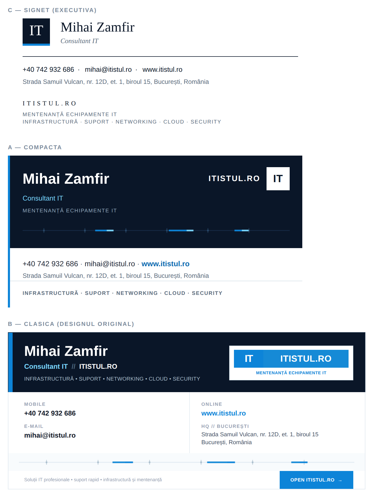

# Semnături e-mail — Mihai Zamfir / ITISTUL.RO

**Două** semnături Outlook grafice și animate, ambele **fără nimic de urcat pe site**.
Instalatorul le pune pe amândouă; le comuți din Outlook la compunerea unui mesaj
(`Message > Signature`).



| | „Mihai Zamfir" | „Mihai Zamfir - Clasic" |
|---|---|---|
| Design | compact, reproiectat | **designul tău original** |
| Lățime | 560 px | 680 px |
| Sursă HTML | 8,1 KB | 14,8 KB |
| Bandă animată | 508×28, 11 KB | 638×26, 10 KB |
| Implicită | da | `INSTALEAZA-SEMNATURA.cmd clasic` |

Ambele au aceleași protecții, aceleași diacritice ca entități numerice, același
mecanism de atașare inline a benzii. Diferă doar compoziția.

## Designul clasic — ce s-a păstrat și ce s-a reparat

Compoziția, paleta, mărimile și textele sunt **exact** cele din pachetul original:
blocul bleumarin cu bara albastră de 8 px, plăcuța logo cu cele două dale, coloanele
`MOBILE`/`E-MAIL` și `ONLINE`/`HQ`, banda animată, sloganul din subsol și butonul
`OPEN ITISTUL.RO →`.

S-au schimbat doar lucrurile care îl stricau la destinatar:

| Ce era | De ce strica | Ce s-a făcut |
|---|---|---|
| 4 tabele suprapuse la nivel superior | Word inserează un paragraf gol `MsoNormal` între două tabele adiacente — de aici spațiile inegale între benzi | un singur tabel cu rânduri |
| 13 `<div>` de layout | Word nu aplică fiabil `padding`/`margin` pe `<div>` | `<td>` și `<p style="margin:0;padding:0">` |
| `width="50%"` + padding pe aceeași celulă | modelul de casetă se rezolvă diferit între clienți | coloane în pixeli, care însumează exact 678 |
| GIF remote de 132 KB, 640×36 | blocat implicit; cadru gol la blocare | 638×26, 10 KB, atașat inline, fundal `#f8fbfd` identic cu celula |
| `font-weight:800` | nesuportat de motorul Word | 700 |
| `font-size:10.5px` | dimensiunile fracționare se rotunjesc imprevizibil | 11 px |
| diacritice brute UTF-8 | Outlook rescrie fișierul și le poate strica | entități numerice |
| linkuri fără `<span>` | stilul de caracter Hyperlink din Word rescrie fontul și culoarea | `<a><span>` cu formatare repetată |

### Ce trebuie să știi înainte să alegi clasica

- **E de 1,8× mai grea** (14,8 KB față de 8,1 KB). Într-un fir citat de 4–5 ori se
  apropie de pragul de 102 KB la care Gmail taie mesajul cu „[Message clipped]".
- **680 px** depășește panoul de citire la o fereastră Outlook obișnuită și se
  micșorează pe telefoanele înguste.
- Etichetele `MOBILE`/`E-MAIL`/`ONLINE`/`HQ` folosesc `#98a2b3` la 9 px, adică un
  contrast de **2,58:1** — sub pragul WCAG AA de 4,5:1. Am păstrat culoarea exact
  cum era în pachetul tău. Dacă vrei să o repari, înlocuiește `#98a2b3` cu `#7d8899`
  în `semnatura-clasic/` și rulează `python3 verifica.py`.
- Butonul `OPEN ITISTUL.RO →` este un element de tip reclamă într-o semnătură și
  adaugă puțin la scorul de spam. E linkul curat către site, fără parametri de
  urmărire, deci efectul e mic — dar există.

Dacă niciuna dintre observațiile astea nu te deranjează, folosește clasica liniștit.
Dacă trimiți des în fire lungi, pune compacta implicită și clasica pe mesajele noi.

---

## Cum funcționează animația fără hosting

Banda animată stă local, în folderul companion al semnăturii:

```
%APPDATA%\Microsoft\Signatures\
    Mihai Zamfir.htm
    Mihai Zamfir_files\
        itistul-signal.gif              ← 11 KB
        filelist.xml
    Mihai Zamfir - Clasic.htm
    Mihai Zamfir - Clasic_files\
        itistul-pulse-clasic.gif        ← 10 KB
        filelist.xml
```

La fiecare mesaj, Outlook **atașează imaginea inline în mesaj** (`Content-ID`, sau
CID) și rescrie automat `src`-ul. Este exact mecanismul nativ pe care îl folosește
editorul de semnături din Outlook când inserezi o poză.

De aici vine avantajul real:

> Blocarea automată a imaginilor din clienții de mail se aplică **doar imaginilor
> remote**. O imagine atașată inline face parte din mesaj, deci se afișează
> întotdeauna — fără bara „Click here to download pictures".

Ce dispare complet față de varianta cu GIF hostat:

- nimic de urcat pe itistul.ro, nimic de întreținut;
- nicio cerere HTTP externă la deschiderea mesajului;
- niciun risc de hotlink 403, certificat expirat sau `Content-Type` greșit;
- nicio euristică de tracking pixel — nu există URL de urmărit;
- nicio gazdă de imagine expusă la liste URIBL.

Costul: mesajul crește cu 11 KB, iar unele gateway-uri foarte stricte scanează
atașamentele inline. În practică semnăturile cu imagini inline sunt printre cele
mai comune mesaje de pe internet, deci nu constituie un semnal de spam.

---

## Cum e construită

| Element | Cum e făcut | Dacă lipsește |
|---|---|---|
| Bloc bleumarin, bară de accent, pătrat logo | `bgcolor` pe `<td>` | nu se poate pierde |
| Nume, ITISTUL.RO, contacte, adresă, discipline | text HTML | nu se poate pierde |
| Banda de semnal animată | 1 GIF inline, 508×28, 11 KB | rămâne bleumarin curat |

Detalii care contează:

- Fundalul GIF-ului este **exact** `#0a1628`, aceeași valoare ca `bgcolor`-ul celulei
  care îl conține. Dacă din orice motiv banda nu ajunge la destinatar, în locul ei
  rămâne fundal bleumarin — nu o imagine ruptă, nu un gol alb, layout neschimbat.
- **Cadrul 1 este desenat separat**, cu traseu complet, marcaje și patru pachete
  distribuite pe lățime. Motorul Word din Outlook Classic desenează doar cadrul 1
  al oricărui GIF animat — nu e o limitare a acestui pachet și nu se poate ocoli,
  deci acel cadru trebuie să arate ca un grafic terminat.
- `width` și `height` declarate și ca atribut și în CSS: spațiul e rezervat înainte
  de încărcare, layout-ul nu sare.
- `alt=""` — element decorativ: cititoarele de ecran îl sar.

### Unde se vede animația

| Client | Animație |
|---|---|
| Outlook Web / new Outlook, Outlook Mac, Outlook iOS și Android | **da** |
| Gmail, Apple Mail, Thunderbird, Yahoo | **da** |
| **Outlook Classic pe Windows** | nu — doar cadrul 1, care e desenat să arate finisat |

---

## Instalare

1. Dezarhivează tot folderul pe disc (nu rula din interiorul arhivei).
2. Închide Outlook complet.
3. Dublu-clic pe `instalare/INSTALEAZA-SEMNATURA.cmd`.

Atât. Nu mai e niciun pas de upload.

Instalatorul este **batch pur** — fără PowerShell, fără `ExecutionPolicy Bypass`,
fără drepturi de administrator. Scrie doar în profilul tău (`HKCU` și `%APPDATA%`):

- face backup al semnăturii existente, inclusiv folderul companion, în
  `%APPDATA%\Microsoft\Signatures\_backup_ITISTUL\`;
- copiază `.htm`, `.rtf`, `.txt` **și** folderul `Mihai Zamfir_files\`;
- o setează implicită pentru mesaje noi și pentru răspunsuri;
- marchează `.htm` **read-only**, ca Outlook să nu rescrie fișierul prin
  serializatorul Word — cauza clasică pentru „mi s-a stricat semnătura singură";
- dezactivează **semnăturile roaming** Microsoft 365, care altfel suprascriu din
  cloud fișierul local.

Argumente:

| Comandă | Efect |
|---|---|
| `INSTALEAZA-SEMNATURA.cmd` | ambele semnături, implicită cea compactă |
| `INSTALEAZA-SEMNATURA.cmd clasic` | ambele, implicită cea clasică |
| `INSTALEAZA-SEMNATURA.cmd fara-imagini` | ambele, variantele fără bandă |
| `INSTALEAZA-SEMNATURA.cmd clasic fara-imagini` | se pot combina |

Anulare completă: `instalare/DEZINSTALEAZA.cmd` (elimină ambele).

Instalatorul scrie un jurnal la `instalare/jurnal-instalare.txt`. Dacă ceva
eșuează, acolo găsești ce sursă lipsea, dacă destinația exista și dacă Outlook
mai rula — trimite fișierul mai departe dacă ai nevoie de ajutor.

> Ca să poți edita din nou semnătura din Outlook:
> `attrib -R "%APPDATA%\Microsoft\Signatures\Mihai Zamfir.htm"`

### Manual, fără niciun script

Vezi `documentatie/INSTALARE-MANUALA.md` — acoperă Outlook Classic, new Outlook,
OWA, Mac și mobil.

---

## Cum transporți pachetul

**Nu trimite arhiva pe e-mail.** `.cmd`, `.ps1` și `.bat` sunt pe lista de extensii
blocate atât la Google Workspace cât și la Exchange Online Protection, iar blocarea
se aplică **și în interiorul unui `.zip`**, inclusiv unul cu parolă. Folosește USB
sau un folder din OneDrive/Google Drive.

Dacă totuși trebuie trimis pe mail, în pachet există `INSTALEAZA-SEMNATURA.cmd.txt` —
destinatarul șterge extensia `.txt` după descărcare.

---

## Varianta fără imagini

`semnatura/varianta-fara-imagini/` este **exact același design**, fără rândul cu
banda și fără folder companion. Zero imagini, mesaje mai mici. Folosește-o dacă
trimiți frecvent către domenii cu filtre foarte agresive pe atașamente.

---

## Structura pachetului

```
email-signature/
├─ semnatura/
│  ├─ Mihai Zamfir.htm          ← se copiază în %APPDATA%\Microsoft\Signatures
│  ├─ Mihai Zamfir.rtf
│  ├─ Mihai Zamfir.txt
│  ├─ Mihai Zamfir_files/       ← banda animată, atașată inline de Outlook
│  │  ├─ itistul-signal.gif
│  │  └─ filelist.xml
│  ├─ fragment.html             ← doar tabelul, pentru copy-paste
│  └─ varianta-fara-imagini/    ← același design, fără bandă
├─ instalare/
│  ├─ INSTALEAZA-SEMNATURA.cmd
│  ├─ INSTALEAZA-SEMNATURA.cmd.txt   ← copie transportabilă pe e-mail
│  └─ DEZINSTALEAZA.cmd
├─ documentatie/
│  ├─ INSTALARE-MANUALA.md
│  ├─ DE-CE-ASA.md              ← deciziile tehnice, cu motivul fiecăreia
│  └─ previzualizare.html       ← deschide în browser
├─ semnatura-clasic/            ← designul original, aceeași structură
├─ genereaza-gif.py             ← regenerează banda compactă
├─ genereaza-gif-clasic.py      ← regenerează banda clasică
└─ verifica.py                  ← 768 verificări, pe ambele semnături
```

## După orice modificare

```
python3 verifica.py
```
